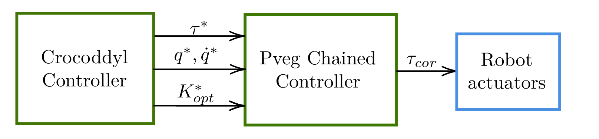

# Chained controller for tiago, based on Crocoddyl


This repo contain the code of a new ros2 controller : cpcc2 (Crocoddyl PVEG(Position Velocity Effort Gains) Chained Controller), added to it, its launch file and config for different actuators characteristics.

## Installation

The controllers are based on ros2_control and make use of launch-pal for the launch files:

```bash
  apt install ros-humble-ros2-control
  apt install ros-humble-ros2-controllers
  apt install ros-humble-launch-pal
```


## Overview


The controller is comprised of 2 smaller ones: one for the high level path planning : Crocoddyl, and the other for the torque to apply calculation : Pveg Chained, those two can be loaded from a single file : [cpcc2_tiago.launch.py](launch/cpcc2_tiago.launch.py)





## Pveg Chained Controller

The PvegChainedController is at the lowest level in the command chain : it is connected directly to the robot
hardware through an hardware interface and sends effort command to the motors. For communicating it might be
tempting to send it command through a topic or a service but that would be an unreliable solution for real time and
fast control of Tiago, we rather turn this controller into a chained one giving it new and fast communication tools :
reference interfaces

## Crocoddyl Controller

The CrocoddylController is a normal feedforward-like controller, it computes the command value and send
them to the PvegChainedController through the virtual hardware interface. From its side those interfaces have nothing special but their prefix name
